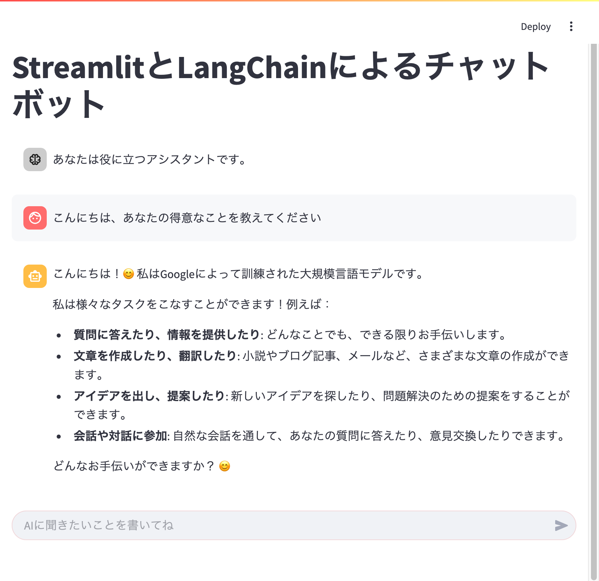

# Streamlit LangChain Chatbot
Streamlitによるチャットボットアプリ。
LLMにはLangChainで、Ollamaに問い合わせます。



## 使用したもの
* [Streamlit](https://streamlit.io/)
* [LangChain](https://www.langchain.com/)
* [Ollama](https://ollama.com/)

## インストール
```
git clone https://github.com/akokubo/streamlit-langchain-chatbot.git
cd streamlit-langchain-chatbot
python3 -m venv venv
source venv/bin/activate
python3 -m pip install --upgrade pip
python3 -m pip install streamlit langchain langchain-openai
```
※Windowsの場合、WSL2の[新しいもの](https://github.com/microsoft/WSL/releases/)をインストールし、アップデート&アップグレードし、python3-pipやpython3.12-venvなどなどをインストールしてからご利用ください。

※仮想環境は、condaなどでもいい。

## Ollamaの準備
1. Ollamaをインストール
   - Windowsの場合は、WSL2で仮想環境から `curl -fsSL https://ollama.com/install.sh | sh` でインストール
   - Macの場合は、[ダウンロード](https://ollama.com/download/windows)してインストール
2. Ollamaで大規模言語モデルの `lucas2024/gemma-2-2b-jpn-it:q8_0` をpullする。
```
ollama pull lucas2024/gemma-2-2b-jpn-it:q8_0
```
※大規模言語モデルは、自由に選べ、他のものでもいい。

## 実行
最初に、プログラムを展開したフォルダに入る。
次に仮想環境に入っていない場合(コマンドプロンプトに(venv)と表示されていないとき)、仮想環境に入る。
```
source venv/bin/activate
```

Ollamaが起動していないかもしれないので、仮想環境に入っている状態で、大規模言語モデルのリストを表示する(すると起動していなければ、起動する)。
```
ollama list
```

仮想環境に入っている状態で、以下のコマンドでアプリを起動する。
```
python3 -m streamlit run app.py
```

## 作者
[小久保 温(こくぼ・あつし)](https://akokubo.github.io/)

## ライセンス
[MIT License](LICENSE)
